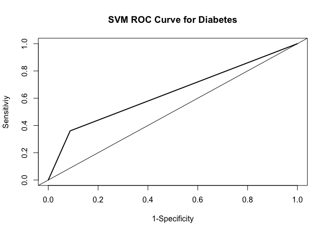

Assignment 6
================
Megan Marziali
Feb 17, 2021

## Assignment Set-Up

``` r
library(tidyverse)
library(NHANES)
library(Amelia)
library(caret)
library(rpart)
library(rpart.plot)
library(pROC)
library(e1071)

data(NHANES)

set.seed(100)
```

## Problem 1: Import and Restrict Data

``` r
nhanes = NHANES %>% 
  janitor::clean_names() %>% 
  select(
    age, race1, education, hh_income, weight, height, 
    pulse, bmi, phys_active, smoke100, diabetes
  )
```

The NHANES data has 10,000 observations. To investigate missingness, I
used the mapping function.

``` r
missmap(nhanes)
```

<!-- -->

It seems that education, smoking and pulse have a large amount of
missing observations. However, I opted to keep all variables and exclude
missing observations. Once missing observations were removed, I recoded
factor variables to numeric to be able to conduct SVC.

``` r
nhanes_restr = nhanes %>% na.omit()

nhanes_svm = nhanes_restr %>% 
  mutate(
    race1 = as.numeric(race1),
    education = as.numeric(education),
    hh_income = as.numeric(hh_income),
    phys_active = as.numeric(phys_active),
    smoke100 = as.numeric(smoke100)
  )
```

With missing observations remove, the total number of observations in
this dataset is 6356. I next checked the balance of the outcome
observations within the dataset:

``` r
summary(nhanes_restr$diabetes)
```

    ##   No  Yes 
    ## 5697  659

There are 5697 “no” responses, and 659 “yes” responses, for a prevalence
of diabetes within this sample of 11.6%.

``` r
train.indices = createDataPartition(y = nhanes_restr$diabetes,p = 0.7,list = FALSE)

training = nhanes_restr[train.indices,]
testing = nhanes_restr[-train.indices,]

train.indices = createDataPartition(y = nhanes_svm$diabetes,p = 0.7,list = FALSE)

train_svm = nhanes_svm[train.indices,]
test_svm = nhanes_svm[-train.indices,]
```

## Problem 2

### Problem 2.1: Classification Tree

``` r
set.seed(100)

train.control = trainControl(method = "cv", number = 10, sampling = "down")
grid.2 = expand.grid(cp = seq(0.001, 0.3, by = 0.01))
tree.diabetes = train(diabetes~., data = training, method = "rpart",trControl = train.control, tuneGrid = grid.2)
tree.diabetes$bestTune
```

    ##      cp
    ## 1 0.001

``` r
grid.3 = expand.grid(cp = seq(0.0005, 0.02, by = 0.001))
tree.diabetes = train(diabetes~., data = training, method = "rpart",trControl = train.control, tuneGrid = grid.3)
tree.diabetes$bestTune
```

    ##       cp
    ## 2 0.0015

``` r
tree.diabetes
```

    ## CART 
    ## 
    ## 4450 samples
    ##   10 predictor
    ##    2 classes: 'No', 'Yes' 
    ## 
    ## No pre-processing
    ## Resampling: Cross-Validated (10 fold) 
    ## Summary of sample sizes: 4005, 4006, 4005, 4006, 4004, 4005, ... 
    ## Addtional sampling using down-sampling
    ## 
    ## Resampling results across tuning parameters:
    ## 
    ##   cp      Accuracy   Kappa    
    ##   0.0005  0.7229455  0.2312364
    ##   0.0015  0.7278863  0.2363016
    ##   0.0025  0.7236070  0.2380192
    ##   0.0035  0.7213599  0.2370257
    ##   0.0045  0.7159727  0.2340518
    ##   0.0055  0.7024839  0.2294559
    ##   0.0065  0.7051725  0.2326477
    ##   0.0075  0.7004473  0.2274627
    ##   0.0085  0.7004423  0.2273646
    ##   0.0095  0.7004423  0.2273646
    ##   0.0105  0.7076359  0.2341902
    ##   0.0115  0.6993212  0.2317778
    ##   0.0125  0.7031374  0.2336077
    ##   0.0135  0.7031374  0.2325521
    ##   0.0145  0.6947996  0.2217910
    ##   0.0155  0.6912030  0.2182481
    ##   0.0165  0.6927761  0.2195420
    ##   0.0175  0.6927761  0.2195420
    ##   0.0185  0.6813154  0.2128686
    ##   0.0195  0.6822143  0.2124048
    ## 
    ## Accuracy was used to select the optimal model using the largest value.
    ## The final value used for the model was cp = 0.0015.

``` r
varImp(tree.diabetes)
```

    ## rpart variable importance
    ## 
    ##   only 20 most important variables shown (out of 38)
    ## 
    ##                          Overall
    ## age                     100.0000
    ## bmi                      72.8776
    ## weight                   66.5032
    ## height                   29.0924
    ## phys_activeYes           23.4883
    ## pulse                    21.7577
    ## race1White               14.7678
    ## hh_incomemore 99999      12.0110
    ## educationSome College    10.7135
    ## educationCollege Grad     8.9685
    ## hh_income55000-64999      2.8480
    ## hh_income15000-19999      1.8785
    ## smoke100Yes               1.8173
    ## race1Other                1.8071
    ## hh_income75000-99999      1.3721
    ## education9 - 11th Grade   1.1087
    ## hh_income25000-34999      0.9776
    ## hh_income10000-14999      0.9392
    ## hh_income45000-54999      0.7633
    ## hh_income35000-44999      0.6446

``` r
rpart.plot(tree.diabetes$finalModel)
```

<!-- -->

``` r
pred.diabetes = predict(tree.diabetes, testing)
pred.diabetes.prob = predict(tree.diabetes, testing, type = "prob")

eval.results = confusionMatrix(pred.diabetes, testing$diabetes, positive = "Yes")
print(eval.results)
```

    ## Confusion Matrix and Statistics
    ## 
    ##           Reference
    ## Prediction   No  Yes
    ##        No  1184   54
    ##        Yes  525  143
    ##                                          
    ##                Accuracy : 0.6962         
    ##                  95% CI : (0.675, 0.7168)
    ##     No Information Rate : 0.8966         
    ##     P-Value [Acc > NIR] : 1              
    ##                                          
    ##                   Kappa : 0.2035         
    ##                                          
    ##  Mcnemar's Test P-Value : <2e-16         
    ##                                          
    ##             Sensitivity : 0.72589        
    ##             Specificity : 0.69280        
    ##          Pos Pred Value : 0.21407        
    ##          Neg Pred Value : 0.95638        
    ##              Prevalence : 0.10336        
    ##          Detection Rate : 0.07503        
    ##    Detection Prevalence : 0.35047        
    ##       Balanced Accuracy : 0.70935        
    ##                                          
    ##        'Positive' Class : Yes            
    ## 

``` r
analysis = roc(response = testing$diabetes, predictor = pred.diabetes.prob[,2])
```

    ## Setting levels: control = No, case = Yes

    ## Setting direction: controls < cases

``` r
plot(1 - analysis$specificities,analysis$sensitivities,type = "l",
ylab = "Sensitiviy",xlab = "1-Specificity",col = "black",lwd = 2,
main = "ROC Curve for Greater Firearm Fatalities")
abline(a = 0,b = 1)
```

<!-- -->

The calculated accuracy of this model is 0.6962.

### Problem 2.2: Support Vector Classification

``` r
set.seed(100)
train_control = trainControl(method = "cv", number = 10)

svm.diabetes = train(diabetes ~ ., data = training, method = "svmLinear", trControl = train_control, preProcess = c("center", "scale"))

svm.diabetes
```

    ## Support Vector Machines with Linear Kernel 
    ## 
    ## 4450 samples
    ##   10 predictor
    ##    2 classes: 'No', 'Yes' 
    ## 
    ## Pre-processing: centered (26), scaled (26) 
    ## Resampling: Cross-Validated (10 fold) 
    ## Summary of sample sizes: 4004, 4005, 4005, 4005, 4006, 4006, ... 
    ## Resampling results:
    ## 
    ##   Accuracy   Kappa
    ##   0.8961806  0    
    ## 
    ## Tuning parameter 'C' was held constant at a value of 1

``` r
#Incorporate different values for cost

svm.diabetes.2 = 
  train(diabetes ~ ., 
        data = training, method = "svmLinear", trControl = train_control,
        preProcess = c("center", "scale"), 
        tuneGrid = expand.grid(C = seq(0.00001,2, length = 30)))

svm.diabetes.2
```

    ## Support Vector Machines with Linear Kernel 
    ## 
    ## 4450 samples
    ##   10 predictor
    ##    2 classes: 'No', 'Yes' 
    ## 
    ## Pre-processing: centered (26), scaled (26) 
    ## Resampling: Cross-Validated (10 fold) 
    ## Summary of sample sizes: 4005, 4005, 4005, 4005, 4005, 4005, ... 
    ## Resampling results across tuning parameters:
    ## 
    ##   C           Accuracy   Kappa
    ##   0.00001000  0.8961798  0    
    ##   0.06897517  0.8961798  0    
    ##   0.13794034  0.8961798  0    
    ##   0.20690552  0.8961798  0    
    ##   0.27587069  0.8961798  0    
    ##   0.34483586  0.8961798  0    
    ##   0.41380103  0.8961798  0    
    ##   0.48276621  0.8961798  0    
    ##   0.55173138  0.8961798  0    
    ##   0.62069655  0.8961798  0    
    ##   0.68966172  0.8961798  0    
    ##   0.75862690  0.8961798  0    
    ##   0.82759207  0.8961798  0    
    ##   0.89655724  0.8961798  0    
    ##   0.96552241  0.8961798  0    
    ##   1.03448759  0.8961798  0    
    ##   1.10345276  0.8961798  0    
    ##   1.17241793  0.8961798  0    
    ##   1.24138310  0.8961798  0    
    ##   1.31034828  0.8961798  0    
    ##   1.37931345  0.8961798  0    
    ##   1.44827862  0.8961798  0    
    ##   1.51724379  0.8961798  0    
    ##   1.58620897  0.8961798  0    
    ##   1.65517414  0.8961798  0    
    ##   1.72413931  0.8961798  0    
    ##   1.79310448  0.8961798  0    
    ##   1.86206966  0.8961798  0    
    ##   1.93103483  0.8961798  0    
    ##   2.00000000  0.8961798  0    
    ## 
    ## Accuracy was used to select the optimal model using the largest value.
    ## The final value used for the model was C = 1e-05.

``` r
plot(svm.diabetes.2)
```

<!-- -->

``` r
svm.diabetes.2$finalModel
```

    ## Support Vector Machine object of class "ksvm" 
    ## 
    ## SV type: C-svc  (classification) 
    ##  parameter : cost C = 1e-05 
    ## 
    ## Linear (vanilla) kernel function. 
    ## 
    ## Number of Support Vectors : 924 
    ## 
    ## Objective Function Value : -0.0092 
    ## Training error : 0.10382

The accuracy of this model is 0.896.

### Problem 2.3: Logistic Regression

``` r
lr.diabetes = glm(diabetes ~ . ,family = binomial(link = 'logit'),data = training)
summary(lr.diabetes)
```

    ## 
    ## Call:
    ## glm(formula = diabetes ~ ., family = binomial(link = "logit"), 
    ##     data = training)
    ## 
    ## Deviance Residuals: 
    ##     Min       1Q   Median       3Q      Max  
    ## -1.9204  -0.4607  -0.2791  -0.1566   3.2422  
    ## 
    ## Coefficients:
    ##                           Estimate Std. Error z value Pr(>|z|)    
    ## (Intercept)             -13.522930   3.913540  -3.455 0.000549 ***
    ## age                       0.069657   0.004156  16.763  < 2e-16 ***
    ## race1Hispanic            -0.374661   0.298852  -1.254 0.209964    
    ## race1Mexican              0.239863   0.247173   0.970 0.331834    
    ## race1White               -0.700768   0.165041  -4.246 2.18e-05 ***
    ## race1Other                0.314452   0.251140   1.252 0.210533    
    ## education9 - 11th Grade  -0.576037   0.239808  -2.402 0.016302 *  
    ## educationHigh School     -0.276874   0.218881  -1.265 0.205889    
    ## educationSome College    -0.240865   0.217732  -1.106 0.268620    
    ## educationCollege Grad    -0.268245   0.236749  -1.133 0.257201    
    ## hh_income 5000-9999       0.148165   0.482085   0.307 0.758583    
    ## hh_income10000-14999      0.068170   0.438531   0.155 0.876466    
    ## hh_income15000-19999     -0.091915   0.442880  -0.208 0.835590    
    ## hh_income20000-24999      0.193453   0.436207   0.443 0.657411    
    ## hh_income25000-34999     -0.341353   0.428809  -0.796 0.426004    
    ## hh_income35000-44999     -0.156380   0.426197  -0.367 0.713680    
    ## hh_income45000-54999     -0.370690   0.440782  -0.841 0.400358    
    ## hh_income55000-64999      0.084637   0.442085   0.191 0.848173    
    ## hh_income65000-74999     -0.490210   0.465281  -1.054 0.292076    
    ## hh_income75000-99999     -0.252180   0.433066  -0.582 0.560357    
    ## hh_incomemore 99999      -0.384052   0.423965  -0.906 0.365011    
    ## weight                   -0.012461   0.020455  -0.609 0.542395    
    ## height                    0.028163   0.022680   1.242 0.214340    
    ## pulse                     0.011838   0.004592   2.578 0.009934 ** 
    ## bmi                       0.130678   0.058353   2.239 0.025126 *  
    ## phys_activeYes           -0.153347   0.117329  -1.307 0.191219    
    ## smoke100Yes               0.227447   0.112100   2.029 0.042462 *  
    ## ---
    ## Signif. codes:  0 '***' 0.001 '**' 0.01 '*' 0.05 '.' 0.1 ' ' 1
    ## 
    ## (Dispersion parameter for binomial family taken to be 1)
    ## 
    ##     Null deviance: 2967.2  on 4449  degrees of freedom
    ## Residual deviance: 2353.9  on 4423  degrees of freedom
    ## AIC: 2407.9
    ## 
    ## Number of Fisher Scoring iterations: 6

``` r
fitted.results.2 = predict(lr.diabetes, testing, type = 'response') 
fitted.results.p.2 = ifelse(fitted.results.2 > 0.5,1,0)

testing.outcome.2 = (as.numeric(testing$diabetes) - 1)

misClasificError.2 = mean(fitted.results.p.2 != testing.outcome.2, na.rm = T)
print(paste('Accuracy Model LR',1 - misClasificError.2))
```

    ## [1] "Accuracy Model LR 0.892444910807975"

The accuracy of this model is 0.892.
