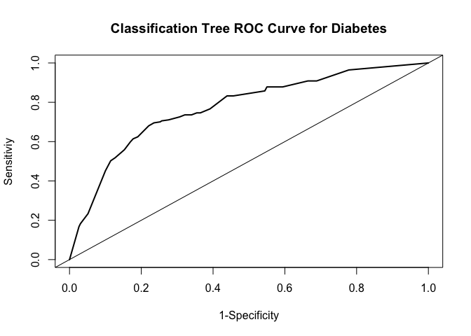

Assignment 6
================
Megan Marziali
Feb 17, 2021

## Assignment Set-Up

``` r
library(tidyverse)
library(NHANES)
library(Amelia)
library(caret)
library(rpart)
library(rpart.plot)
library(pROC)
library(e1071)

data(NHANES)

set.seed(100)
```

## Problem 1: Import and Restrict Data

``` r
nhanes = NHANES %>% 
  janitor::clean_names() %>% 
  select(
    age, race1, education, hh_income, weight, height, 
    pulse, bmi, phys_active, smoke100, diabetes
  )
```

The NHANES data has 10,000 observations. To investigate missingness, I
used the mapping function.

``` r
missmap(nhanes)
```

<!-- -->

It seems that education, smoking and pulse have a large amount of
missing observations. However, I opted to keep all variables and exclude
missing observations.

``` r
nhanes_restr = nhanes %>% na.omit()
```

With missing observations remove, the total number of observations in
this dataset is 6356. I next checked the balance of the outcome
observations within the dataset:

``` r
summary(nhanes_restr$diabetes) %>% 
  knitr::kable()
```

|     |    x |
| :-- | ---: |
| No  | 5697 |
| Yes |  659 |

There are 5697 “no” responses, and 659 “yes” responses, for a prevalence
of diabetes within this sample of 11.6%. This could be considered a rare
outcome, and thus the analysis is conducted assuming rare outcome.

``` r
train.indices = createDataPartition(y = nhanes_restr$diabetes,p = 0.7,list = FALSE)

training = nhanes_restr[train.indices,]
testing = nhanes_restr[-train.indices,]
```

## Problem 2/3/4: Model Fit, Cross-Validation and Accuracy Testing

### Part 1: Classification Tree

The following code chunk runs through model fitting of a classification
tree, and selecting appropriate hyperparameters using cross-validation.
Final accuracy testing is also accomplished.

``` r
set.seed(100)

# Creation of the train.control object to be carried through all modeling steps
train.control = trainControl(method = "cv", number = 10, sampling = "down") 
# (Using sampling down method because rare outcome)

# Exploring appropriate hyperparameters via cross-validation 
grid.2 = expand.grid(cp = seq(0.001, 0.3, by = 0.01))
tree.diabetes = train(diabetes~., data = training, method = "rpart",trControl = train.control, tuneGrid = grid.2)
tree.diabetes$bestTune
```

    ##      cp
    ## 1 0.001

``` r
tree.diabetes
```

    ## CART 
    ## 
    ## 4450 samples
    ##   10 predictor
    ##    2 classes: 'No', 'Yes' 
    ## 
    ## No pre-processing
    ## Resampling: Cross-Validated (10 fold) 
    ## Summary of sample sizes: 4004, 4005, 4005, 4005, 4006, 4006, ... 
    ## Addtional sampling using down-sampling
    ## 
    ## Resampling results across tuning parameters:
    ## 
    ##   cp     Accuracy   Kappa    
    ##   0.001  0.7195369  0.2380176
    ##   0.011  0.7089821  0.2327628
    ##   0.021  0.6660480  0.2057886
    ##   0.031  0.6332637  0.1856743
    ##   0.041  0.6002512  0.1666378
    ##   0.051  0.5768515  0.1536312
    ##   0.061  0.5768515  0.1536312
    ##   0.071  0.5768515  0.1536312
    ##   0.081  0.5768515  0.1536312
    ##   0.091  0.5768515  0.1536312
    ##   0.101  0.5768515  0.1536312
    ##   0.111  0.5768515  0.1536312
    ##   0.121  0.5768515  0.1536312
    ##   0.131  0.5768515  0.1536312
    ##   0.141  0.5768515  0.1536312
    ##   0.151  0.5768515  0.1536312
    ##   0.161  0.5768515  0.1536312
    ##   0.171  0.5768515  0.1536312
    ##   0.181  0.5768515  0.1536312
    ##   0.191  0.5768515  0.1536312
    ##   0.201  0.5768515  0.1536312
    ##   0.211  0.5768515  0.1536312
    ##   0.221  0.5768515  0.1536312
    ##   0.231  0.5768515  0.1536312
    ##   0.241  0.5768515  0.1536312
    ##   0.251  0.5768515  0.1536312
    ##   0.261  0.5768515  0.1536312
    ##   0.271  0.5768515  0.1536312
    ##   0.281  0.5768515  0.1536312
    ##   0.291  0.5768515  0.1536312
    ## 
    ## Accuracy was used to select the optimal model using the largest value.
    ## The final value used for the model was cp = 0.001.

``` r
# Exploring hyperparameters with smaller steps
grid.3 = expand.grid(cp = seq(0.0005, 0.02, by = 0.001))
tree.diabetes.2 = train(diabetes~., data = training, method = "rpart",trControl = train.control, tuneGrid = grid.3)
tree.diabetes.2$bestTune
```

    ##       cp
    ## 2 0.0015

``` r
tree.diabetes.2
```

    ## CART 
    ## 
    ## 4450 samples
    ##   10 predictor
    ##    2 classes: 'No', 'Yes' 
    ## 
    ## No pre-processing
    ## Resampling: Cross-Validated (10 fold) 
    ## Summary of sample sizes: 4005, 4006, 4005, 4006, 4004, 4005, ... 
    ## Addtional sampling using down-sampling
    ## 
    ## Resampling results across tuning parameters:
    ## 
    ##   cp      Accuracy   Kappa    
    ##   0.0005  0.7229455  0.2312364
    ##   0.0015  0.7278863  0.2363016
    ##   0.0025  0.7236070  0.2380192
    ##   0.0035  0.7213599  0.2370257
    ##   0.0045  0.7159727  0.2340518
    ##   0.0055  0.7024839  0.2294559
    ##   0.0065  0.7051725  0.2326477
    ##   0.0075  0.7004473  0.2274627
    ##   0.0085  0.7004423  0.2273646
    ##   0.0095  0.7004423  0.2273646
    ##   0.0105  0.7076359  0.2341902
    ##   0.0115  0.6993212  0.2317778
    ##   0.0125  0.7031374  0.2336077
    ##   0.0135  0.7031374  0.2325521
    ##   0.0145  0.6947996  0.2217910
    ##   0.0155  0.6912030  0.2182481
    ##   0.0165  0.6927761  0.2195420
    ##   0.0175  0.6927761  0.2195420
    ##   0.0185  0.6813154  0.2128686
    ##   0.0195  0.6822143  0.2124048
    ## 
    ## Accuracy was used to select the optimal model using the largest value.
    ## The final value used for the model was cp = 0.0015.

``` r
varImp(tree.diabetes.2)
```

    ## rpart variable importance
    ## 
    ##   only 20 most important variables shown (out of 38)
    ## 
    ##                          Overall
    ## age                     100.0000
    ## bmi                      72.8776
    ## weight                   66.5032
    ## height                   29.0924
    ## phys_activeYes           23.4883
    ## pulse                    21.7577
    ## race1White               14.7678
    ## hh_incomemore 99999      12.0110
    ## educationSome College    10.7135
    ## educationCollege Grad     8.9685
    ## hh_income55000-64999      2.8480
    ## hh_income15000-19999      1.8785
    ## smoke100Yes               1.8173
    ## race1Other                1.8071
    ## hh_income75000-99999      1.3721
    ## education9 - 11th Grade   1.1087
    ## hh_income25000-34999      0.9776
    ## hh_income10000-14999      0.9392
    ## hh_income45000-54999      0.7633
    ## hh_income35000-44999      0.6446

``` r
rpart.plot(tree.diabetes.2$finalModel)
```

<!-- -->

``` r
# Using best fit model from above with testing data
pred.diabetes = predict(tree.diabetes.2, testing)
pred.diabetes.prob = predict(tree.diabetes.2, testing, type = "prob")

# Evaluating in testing data with confusion matrix
eval.results = confusionMatrix(pred.diabetes, testing$diabetes, positive = "Yes")
print(eval.results)
```

    ## Confusion Matrix and Statistics
    ## 
    ##           Reference
    ## Prediction   No  Yes
    ##        No  1184   54
    ##        Yes  525  143
    ##                                          
    ##                Accuracy : 0.6962         
    ##                  95% CI : (0.675, 0.7168)
    ##     No Information Rate : 0.8966         
    ##     P-Value [Acc > NIR] : 1              
    ##                                          
    ##                   Kappa : 0.2035         
    ##                                          
    ##  Mcnemar's Test P-Value : <2e-16         
    ##                                          
    ##             Sensitivity : 0.72589        
    ##             Specificity : 0.69280        
    ##          Pos Pred Value : 0.21407        
    ##          Neg Pred Value : 0.95638        
    ##              Prevalence : 0.10336        
    ##          Detection Rate : 0.07503        
    ##    Detection Prevalence : 0.35047        
    ##       Balanced Accuracy : 0.70935        
    ##                                          
    ##        'Positive' Class : Yes            
    ## 

``` r
# ROC curve
analysis = roc(response = testing$diabetes, predictor = pred.diabetes.prob[,2])
```

    ## Setting levels: control = No, case = Yes

    ## Setting direction: controls < cases

``` r
plot(1 - analysis$specificities,
     analysis$sensitivities,
     type = "l",
     ylab = "Sensitiviy",
     xlab = "1-Specificity",
     col = "black",
     lwd = 2,
     main = "Classification Tree ROC Curve for Diabetes") %>% 
  abline(a = 0,b = 1)
```

<!-- -->

The calculated accuracy of this model is **0.70**.

### Part 2: Support Vector Classification

``` r
set.seed(100)

# Exploring appropriate hyperparameters via cross-validation 
svm.diabetes = 
  train(diabetes ~ ., 
        data = training, 
        method = "svmLinear", 
        trControl = train.control, 
        preProcess = c("center", "scale"))
svm.diabetes
```

    ## Support Vector Machines with Linear Kernel 
    ## 
    ## 4450 samples
    ##   10 predictor
    ##    2 classes: 'No', 'Yes' 
    ## 
    ## Pre-processing: centered (26), scaled (26) 
    ## Resampling: Cross-Validated (10 fold) 
    ## Summary of sample sizes: 4004, 4005, 4005, 4005, 4006, 4006, ... 
    ## Addtional sampling using down-sampling prior to pre-processing
    ## 
    ## Resampling results:
    ## 
    ##   Accuracy   Kappa    
    ##   0.7173003  0.2427984
    ## 
    ## Tuning parameter 'C' was held constant at a value of 1

``` r
# Incorporate different values for cost
svm.diabetes.2 = 
  train(diabetes ~ ., 
        data = training, 
        method = "svmLinear", 
        trControl = train.control,
        preProcess = c("center", "scale"), 
        tuneGrid = expand.grid(C = seq(0.00001,2, length = 30)))
svm.diabetes.2
```

    ## Support Vector Machines with Linear Kernel 
    ## 
    ## 4450 samples
    ##   10 predictor
    ##    2 classes: 'No', 'Yes' 
    ## 
    ## Pre-processing: centered (26), scaled (26) 
    ## Resampling: Cross-Validated (10 fold) 
    ## Summary of sample sizes: 4005, 4006, 4005, 4006, 4004, 4005, ... 
    ## Addtional sampling using down-sampling prior to pre-processing
    ## 
    ## Resampling results across tuning parameters:
    ## 
    ##   C           Accuracy   Kappa    
    ##   0.00001000  0.8465211  0.2474822
    ##   0.06897517  0.7116752  0.2437939
    ##   0.13794034  0.7143850  0.2386892
    ##   0.20690552  0.7161843  0.2480221
    ##   0.27587069  0.7166231  0.2448385
    ##   0.34483586  0.7195500  0.2486279
    ##   0.41380103  0.7242797  0.2597925
    ##   0.48276621  0.7161777  0.2548571
    ##   0.55173138  0.7172952  0.2517097
    ##   0.62069655  0.7141618  0.2546076
    ##   0.68966172  0.7233627  0.2582612
    ##   0.75862690  0.7137038  0.2460302
    ##   0.82759207  0.7110056  0.2382769
    ##   0.89655724  0.7163994  0.2483410
    ##   0.96552241  0.7170710  0.2543951
    ##   1.03448759  0.7137043  0.2460297
    ##   1.10345276  0.7170715  0.2464798
    ##   1.17241793  0.7121282  0.2497368
    ##   1.24138310  0.7125781  0.2404351
    ##   1.31034828  0.7186426  0.2505035
    ##   1.37931345  0.7175275  0.2514435
    ##   1.44827862  0.7179800  0.2473664
    ##   1.51724379  0.7190970  0.2485434
    ##   1.58620897  0.7163994  0.2450864
    ##   1.65517414  0.7177371  0.2468851
    ##   1.72413931  0.7127958  0.2462404
    ##   1.79310448  0.7132574  0.2473582
    ##   1.86206966  0.7186496  0.2541806
    ##   1.93103483  0.7186421  0.2477779
    ##   2.00000000  0.7202161  0.2521596
    ## 
    ## Accuracy was used to select the optimal model using the largest value.
    ## The final value used for the model was C = 1e-05.

``` r
svm.diabetes.2$finalModel
```

    ## Support Vector Machine object of class "ksvm" 
    ## 
    ## SV type: C-svc  (classification) 
    ##  parameter : cost C = 1e-05 
    ## 
    ## Linear (vanilla) kernel function. 
    ## 
    ## Number of Support Vectors : 924 
    ## 
    ## Objective Function Value : -0.0092 
    ## Training error : 0.351732

``` r
# Found accuracy to be better for the second model, using this going forward.

# Testing the second SVM model in the testing dataest
svm.pred = predict(svm.diabetes.2, newdata = testing[,1:10])

svm.pred.prob = predict(svm.diabetes.2, testing, type = "raw")

table(svm.pred, testing$diabetes)
```

    ##         
    ## svm.pred   No  Yes
    ##      No  1559  126
    ##      Yes  150   71

``` r
confusionMatrix(svm.pred, testing$diabetes, positive = "Yes")
```

    ## Confusion Matrix and Statistics
    ## 
    ##           Reference
    ## Prediction   No  Yes
    ##        No  1559  126
    ##        Yes  150   71
    ##                                           
    ##                Accuracy : 0.8552          
    ##                  95% CI : (0.8386, 0.8707)
    ##     No Information Rate : 0.8966          
    ##     P-Value [Acc > NIR] : 1.0000          
    ##                                           
    ##                   Kappa : 0.2587          
    ##                                           
    ##  Mcnemar's Test P-Value : 0.1662          
    ##                                           
    ##             Sensitivity : 0.36041         
    ##             Specificity : 0.91223         
    ##          Pos Pred Value : 0.32127         
    ##          Neg Pred Value : 0.92522         
    ##              Prevalence : 0.10336         
    ##          Detection Rate : 0.03725         
    ##    Detection Prevalence : 0.11595         
    ##       Balanced Accuracy : 0.63632         
    ##                                           
    ##        'Positive' Class : Yes             
    ## 

The calculated accuracy of this model is **0.83**.

### Part 3: Logistic Regression

``` r
# Building logistic regression model
lr.diabetes = 
  train(diabetes ~ ., 
        data = training, 
        trControl = train.control, 
        method = "glm", 
        family = binomial())

# Running with testing data
lr.pred = predict(lr.diabetes, testing, type = "raw")
confusionMatrix(lr.pred, testing$diabetes, positive = "Yes")
```

    ## Confusion Matrix and Statistics
    ## 
    ##           Reference
    ## Prediction   No  Yes
    ##        No  1228   49
    ##        Yes  481  148
    ##                                          
    ##                Accuracy : 0.7219         
    ##                  95% CI : (0.7012, 0.742)
    ##     No Information Rate : 0.8966         
    ##     P-Value [Acc > NIR] : 1              
    ##                                          
    ##                   Kappa : 0.2385         
    ##                                          
    ##  Mcnemar's Test P-Value : <2e-16         
    ##                                          
    ##             Sensitivity : 0.75127        
    ##             Specificity : 0.71855        
    ##          Pos Pred Value : 0.23529        
    ##          Neg Pred Value : 0.96163        
    ##              Prevalence : 0.10336        
    ##          Detection Rate : 0.07765        
    ##    Detection Prevalence : 0.33001        
    ##       Balanced Accuracy : 0.73491        
    ##                                          
    ##        'Positive' Class : Yes            
    ## 

The accuracy of this model is **0.73**.

## Problem 5

Given the output above, the best-fitting model is the **support vector
classification model**. One limitation of using an SVC model involves
limited interpretability. While this model can be used to understand the
performance of a single variable, interpretability could be challenging
for the reader of the analysis if they are not well-versed in machine
learning techniques. An additional limitation of this technique is that
SVMs are not suitable for large datasets. Applying this technique for an
analysis within a large dataset may result in long computational times
when training.
